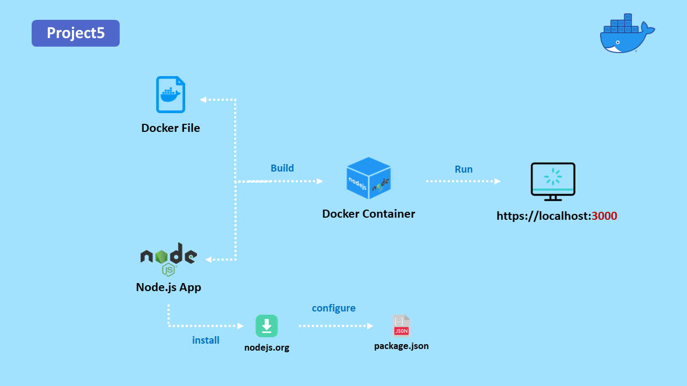

# Dockerizing-a-simple-Node.js-application

### Dockerizing a Node.js application provides several benefits, including portability, scalability, and isolation. The Docker container can be easily deployed on any machine that supports Docker, making it a portable solution that can be easily migrated between different environments. Docker also provides the ability to scale the application by running multiple instances of the container on the same machine or across multiple machines. Finally, Docker provides an isolated environment for running the application, reducing the risk of conflicts with other software or libraries installed on the host machine.

<br>

## The following diagram illustrates the steps involved in this project



<br>

# Step1:
First step is to create a Node js application. The Node.js application contains the index.js and package.json files that define the 
 application's behavior and dependencies. 

<br>

1. Create a new directory for your project and navigate into it:

    ```
    mkdir project5
    cd project5
    ```
2. Create a new file called index.js and add some simple Node.js code to it. For example:

    ```
    const http = require('http');

    const hostname = '0.0.0.0';
    const port = 3000;

    const server = http.createServer((req, res) => {
      res.statusCode = 200;
      res.setHeader('Content-Type', 'text/plain');
      res.end('Hello, World!\n');
    });

    server.listen(port, hostname, () => {
      console.log(`Server running at http://$   {hostname}:${port}/`);
    });

    ```

3. Create a new file called package.json and add the necessary information about your application, such as name, version, dependencies, and scripts. For example:

    ```
    {
      "name": "node-app",
      "version": "1.0.0",
      "description": "A simple Node.js application",
      "main": "index.js",
      "dependencies": {},
      "scripts": {
        "start": "node index.js"
      }
    }
        
    ```

4. Install the necessary dependencies for your application using npm. Make sure you have downloaded node js for your os whether you are using MacOS, Windows or Linux:

    ```
    npm install
    ```

# Step 2:

Second step is to create a Dockerfile. The Dockerfile contains instructions for building a Docker image based on the Node.js runtime, 
 copying the Node.js application into the image, and running the application inside a container. 

 <br>

5. Create a new file called Dockerfile in the root directory of your project. This file will contain instructions for building a Docker image of your application. Here's an example Dockerfile

    ```
    # Use an official Node.js runtime as a parent image
    FROM node:14-alpine

    # Set the working directory to /app
    WORKDIR /app

    # Copy the current directory contents into the  container at /app
    COPY . /app

    # Install any needed packages
    RUN npm install

    # Make port 3000 available to the world outside     this container
    EXPOSE 3000

    # Define environment variable
    ENV NAME node-app

    # Run app.js when the container launches
    CMD ["npm", "start"]
    ```

# Step3:

Third step is to buil and run the Docker container. The Docker image is the result of building the Dockerfile and contains all the 
 necessary components to run the Node.js application inside a Docker container.

<br>

6. Build the Docker image using the following command in the same directory as the Dockerfile:

    ```
    docker build -t node-app .
    ```

7. Run the Docker container using the following command:

    ```
    docker run -p 3000:3000 -d node-app
    ```

<br>

### That's it! You now have a Dockerized Node.js application running in a Docker container. You can access it in your web browser by visiting http://localhost:3000.

<br><br><br><br>

# Watch the FREE demo on YouTube: 

- YouTube: [Dockerizing a simple Node.js application](https://youtu.be/cAFGcfIyKgI)
- LinkedIn: [LinkedIn](https://www.linkedin.com/in/otabek-abdurakhmonov-46772b213/)